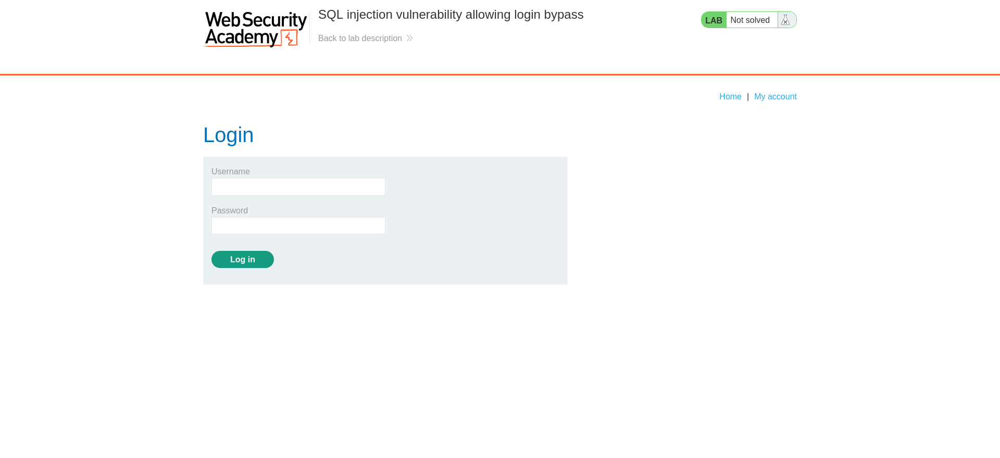
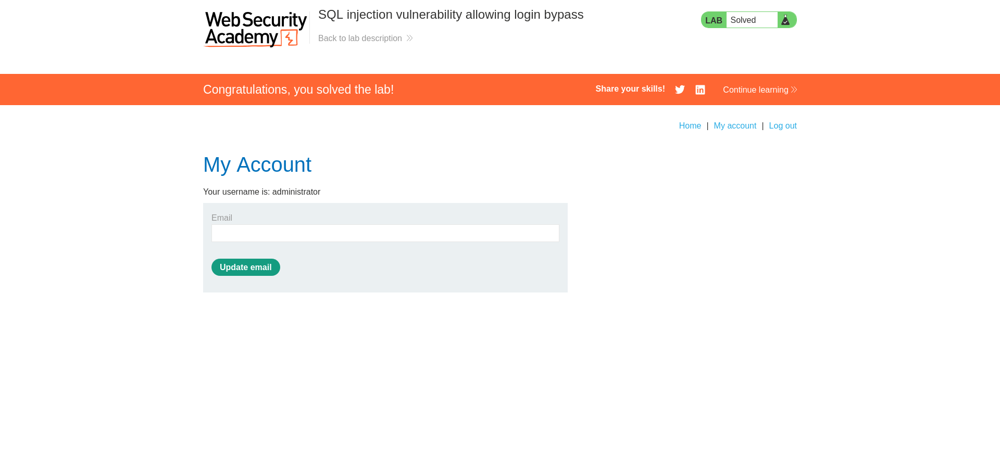

# SQL Injection Penetration Test Report
## PortSwigger SQL injection vulnerability allowing login bypass

**Prepared by:** Elroy Fernandes    
**Date:** January 21, 2026  
**Environment:** Kali Linux (Local Install)  
**Target:** PortSwigger Lab: SQL injection vulnerability allowing login bypass 
**Test Type:** Ethical Hacking - SQL Injection Assessment

---

## Executive Summary

This report documents a successfull SQL injection attack against the PortSwigger login page conducted in a controlled, local environment. The vulnerability allowed authentication bypass using a simple SQLi payload (`' OR 1=1 --`), granting unauthorized administrative access. 
This assessment was performed for educational purposes to demonstrate common web application vulnerabilities and remediation strategies.

**Key Finding:** High-severity SQL Injection (CWE-89) on login functionality  
**Impact:** Complete authentication bypass, full admin privileges  
**Status:** Proof of Concept Achieved

## 1. Scope and Objectives

### Scope
- **Application:** PortSwigger Lab (intentionally vulnerable web application)
- **Environment:** Local Kali Linux deployment
- **Target Component:** User login page
- **Testing Method:** Manual penetration testing

### Objectives
- Identify and exploit authentication vulnerabilities
- Demonstrate SQL injection techniques
- Document findings and remediation steps
- Showcase ethical security testing methodology

---

## 2. Technical Finding: SQL Injection (Authentication Bypass)

### Description

The login form does not use parameterized queries or prepared statements when
validating user credentials. By injecting SQL syntax into the username field,
an attacker can manipulate the backend query logic to always evaluate as true,
resulting in authentication bypass.

---

## Steps to Reproduce (Proof of Concept)

### Step 1: Click on My account
<p aligh="center">
	
</p>

<p align="center">
	
</p>

### Step 2: Inject SQL Payload

Enter the following payload into the Email/Username field:

```sql
admin' OR 1=1--
```
<p align="center">
	

### Step 3: Enter any arbitrary string in the Password field (e.g: SomethingPassword1)
### Step 4: Click Login
### Step 5: Result
The website proccess the query, ignores the password check due to the comment operator (--), and authenticates the user as the administrator.
<p align="center">
	


### Impact
- **Severity:** Critical
- **Confidentiality:** High ( Access to all user data and PII)
- **Integrity:** High ( Ability to modify products, reviews, and user account)
- **Availability:** Medium ( Potential to delete records or drop tables)
  
---

## Technical Analysis
The SQL injection vulnerability exists because:
- **No Input Validation:** Username field accepts special SQL characters (‘, - -,etc.)
- **No Parameterized Queries:** Application uses string concatenation instead of prepared statements.

---

## Remediation recommendations

To prevent this, the development team should implement the following:
- **Use PreparedStatements:** This ensures the database treats the input as data only, not as executable code.
- **Input Validation:** Whitelist allowed characters in username field (alphanumeric + underscore only). Reject inputs containing SQL keywords (SELECT, OR, --,etc.)

---

## Conclusion
This penetration test successfully demonstrated a critical SQL injection vulnerability in the PortSwigger Lab login page. The vulnerability allows an unauthenticated attacker to bypass login controls and gain full administrative access using a simple payload. Implementation of parameterized queries and input validation will effectively remediate this issue. This assessment highlights the importance of secure coding practices and the need for regular security testing in application deployment.

- **Report Status:** Complete
- **Severity Level:** High
- **Remediation:** Timeline: Immediate
